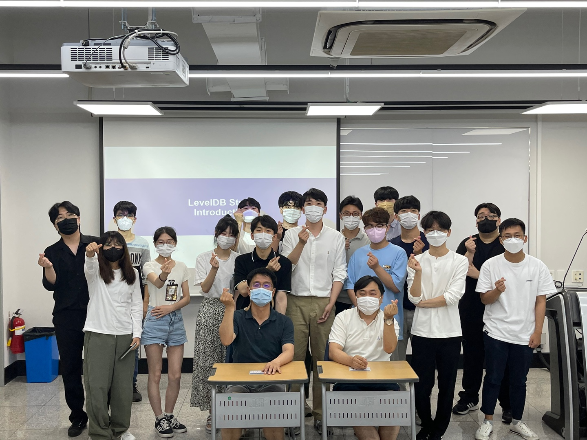

# leveldb-wiki-kor
[DKU System Software Lab](https://sslab.dankook.ac.kr/)에서 진행한 [LevelDB 스터디](https://github.com/DKU-StarLab/leveldb-study)를 통해 작성된 LevelDB wiki입니다.

## 저자
* 학생:
  - 1.WAL/Manifest: [김이수](https://github.com/gooday2die), [박세연](https://github.com/SayOny), [신수환](https://github.com/Student5421)
  - 2.Memtable: [조태규](https://github.com/HASHTAG-YOU), [쥬용지에](https://github.com/arashio1111)
  - 3.Compaction: [강상우](https://github.com/aarom416), [박서영](https://github.com/seo-0), [좌오꾸와쒼](https://github.com/ErosBryant)
  - 4.SSTable: [박종기](https://github.com/JongKI-PARK), [조상현](https://github.com/Cho-SangHyun), [조자영](https://github.com/cho-ja-young)
  - 5.Bloom Filter: [김한수](https://github.com/gillyongs)
  - 6.Cache: [하승원](https://github.com/ha-seungwon), [홍수빈](https://github.com/sss654654)
* 조교: [최민국](https://github.com/korea-choi)
* 선임 조교: [이성현](https://github.com/shl812), [신호진](https://github.com/shinhojin)
* 교수님: [최종무](http://embedded.dankook.ac.kr/~choijm/), [유시환](https://sites.google.com/site/dkumobileos/members/seehwanyoo)

### 배경
1. 키-밸류 스토어란 무엇인가?
2. 왜 오픈소스 인가?
3. 키-밸류 스토어 채용 현황

### LevelDB 코드 분석
0. Overall
1. Key-Value Interface
2. [WAL](./analysis/wal.md)
3. [Memtable](./analysis/memtable.md)
4. [Compaction](./analysis/compaction.md)
5. [SSTable](./analysis/sstable.md)
6. [Bloom Filter](./analysis/bloomfilter.md)
7. [Cache](./analysis/cache.md)
8. [Manifest](./analysis/manifest.md)

### 벤치마크 실험 분석
- [WAL](./benchmarks/wal.md)
- [Memtable](./benchmarks/memtable.md)
- [Compaction](./benchmarks/compaction.md)
- [SSTable](./benchmarks/sstable.md)
- [Bloom Filter](./benchmarks/bloomfilter.md)
- [Cache](./benchmarks/cache.md)

## 부록
1.LevelDB 설치

2.분석툴 사용법
* Understand
* GDB (shell script)
* Uftrace (shell script)  

3.LevelDB db_bench 예제
* [Question](https://github.com/DKU-StarLab/leveldb-study/issues/6)
* [Solution](https://github.com/DKU-StarLab/leveldb-study/blob/main/introduction/homework_solution.md)  

4.Real-world Workload 튜닝 대회
* OSM  

5.[참고문헌](./references.md)

## 사진

## 포스터

